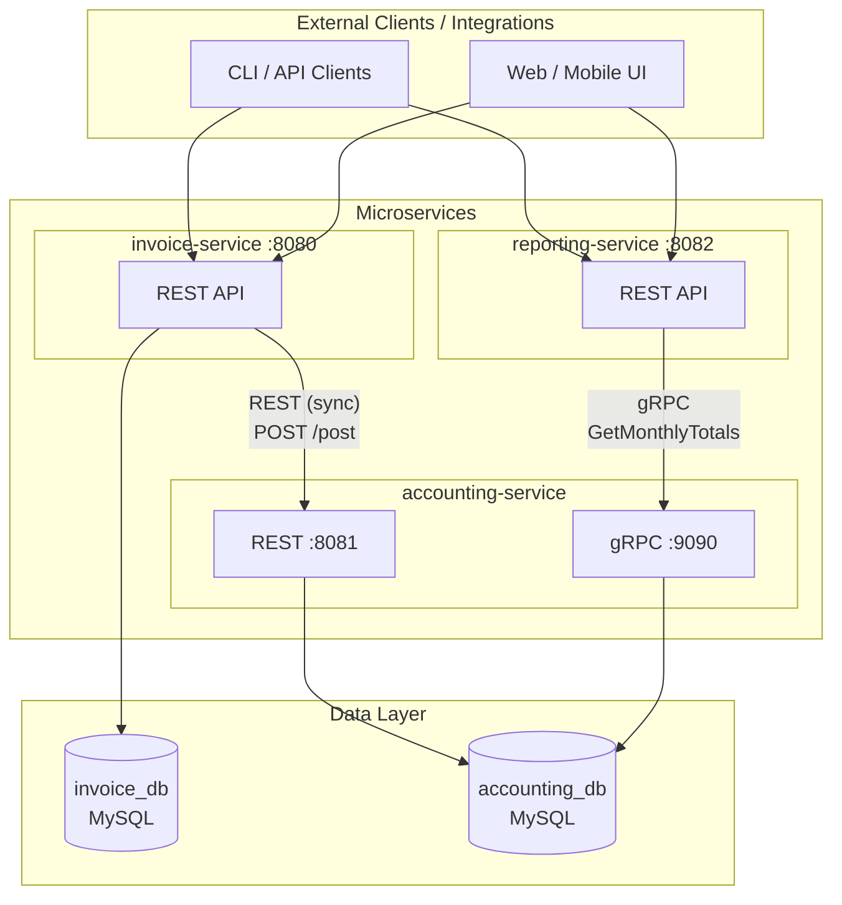
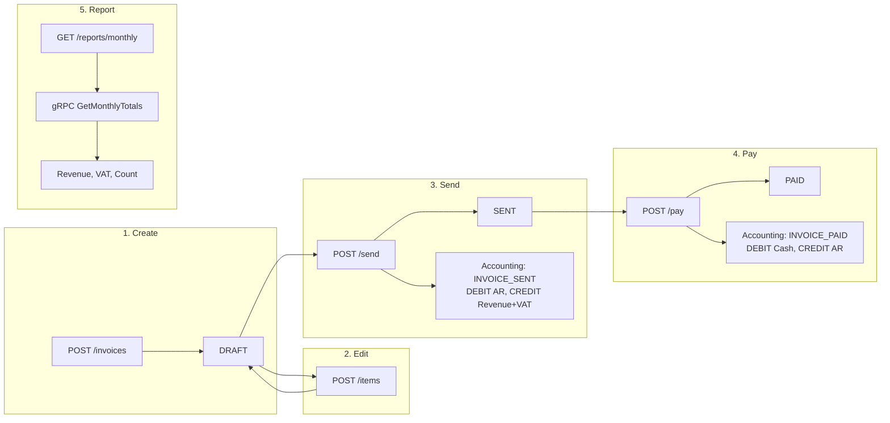
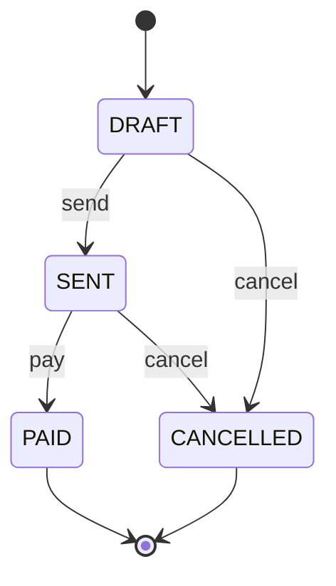
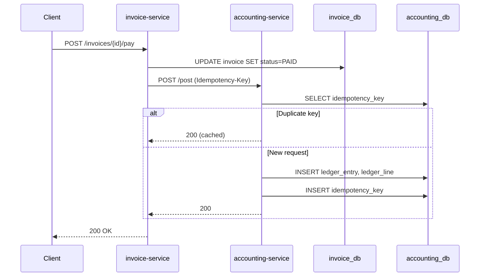
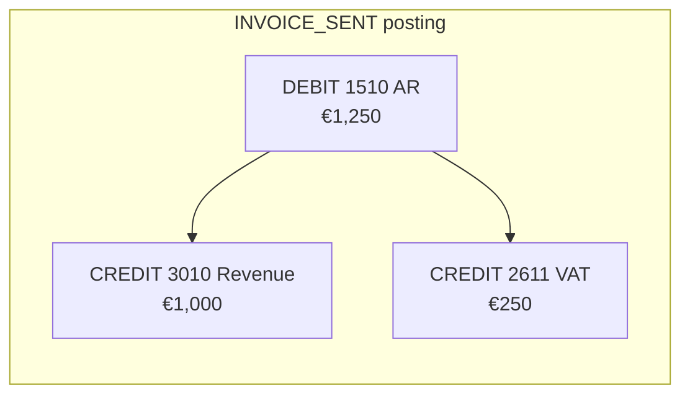
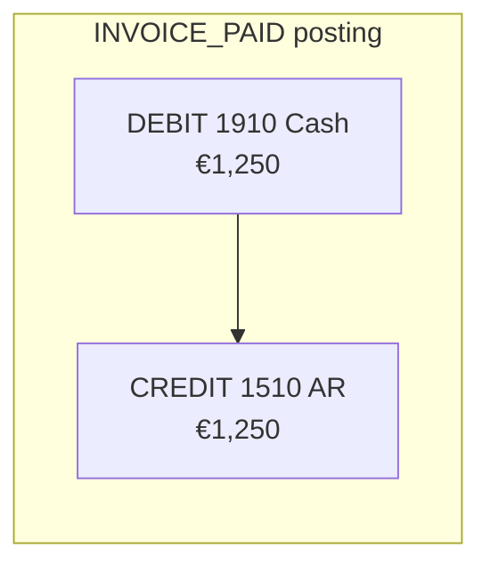

# Automated Invoice & Accounting Engine

A **production-style portfolio project** inspired by automated accounting SaaS (e.g. [Kleer](https://kleer.com)). Demonstrates microservices architecture, double-entry bookkeeping, REST/gRPC APIs, and production concerns like idempotency, optimistic locking, and CI/CD.

---

## For Recruiters

| What you'll see | Why it matters |
|-----------------|----------------|
| **3 microservices** (invoice, accounting, reporting) | Real-world service decomposition; each owns its data |
| **REST + gRPC** | Public APIs vs internal; appropriate protocol choice |
| **Double-entry ledger** | Domain modeling for financial correctness |
| **Idempotency + optimistic locking** | Production-grade concurrency and retry safety |
| **Flyway migrations** | Schema-as-code; no surprise DB changes |
| **Testcontainers** | Integration tests with real MySQL, no mocks |
| **Maven multi-module** | Clean build structure; shared proto in `common` |

**TL;DR:** Create invoice → add items → send → pay → fetch monthly report. Invoice events drive accounting postings; reporting aggregates via gRPC.

---

## Table of Contents

- [For Recruiters](#for-recruiters)
- [Overview](#overview)
- [What This Demonstrates](#what-this-demonstrates)
- [Architecture](#architecture)
- [Domain Model](#domain-model)
- [API Reference](#api-reference)
- [Data Flow](#data-flow)
- [Double-Entry Ledger Example](#double-entry-ledger-example)
- [Design Decisions](#design-decisions)
- [Tech Stack](#tech-stack)
- [Project Structure](#project-structure)
- [Getting Started](#getting-started)
- [Testing](#testing)
- [CI/CD](#cicd)
- [Production Considerations](#production-considerations)

---

## Overview

This system automates the **invoice lifecycle** and **accounting ledger** for a SaaS-style product:

1. **invoice-service** — Public REST API to create invoices, add line items, send them, and mark them paid.
2. **accounting-service** — Ledger engine that generates **double-entry bookkeeping** postings from invoice events (SENT → AR + Revenue; PAID → Cash, AR clearance).
3. **reporting-service** — Produces monthly revenue and VAT summaries by calling accounting via **gRPC**.

Each service has its own MySQL database. Internal service-to-service calls use **gRPC** for performance; external clients use **REST**.

---

## What This Demonstrates

| Area | Implementation |
|------|----------------|
| **Microservices** | 3 services, separate DBs, clear boundaries |
| **Clean architecture** | `controller` → `application` → `domain` → `infrastructure` per service |
| **Domain modeling** | Invoice lifecycle, double-entry ledger, VAT calculation |
| **API design** | REST for public, gRPC for internal; DTOs at boundaries |
| **Data integrity** | BigDecimal (scale 2, HALF_UP), optimistic locking, idempotency |
| **Schema evolution** | Flyway migrations, no JPA `ddl-auto` in prod |
| **Testing** | JUnit 5, Testcontainers (MySQL), Mockito |
| **DevOps** | Docker Compose, Jenkinsfile, Linux-friendly scripts |

---

## Architecture

### System Overview



### Request Flow: Invoice Lifecycle



### Invoice State Machine



### Service Summary

| Service | Ports | Database | Responsibility |
|---------|-------|----------|----------------|
| **invoice-service** | 8080 | `invoice_db` | Invoice CRUD, lifecycle (DRAFT→SENT→PAID), emits events to accounting |
| **accounting-service** | 8081 (REST), 9090 (gRPC) | `accounting_db` | Ledger postings, idempotent event handling, gRPC aggregation API |
| **reporting-service** | 8082 | none | Monthly reports; fetches aggregated totals via gRPC |

---

## Domain Model

### Invoice Domain

| Entity | Fields | Notes |
|--------|--------|-------|
| **Invoice** | `id` (UUID), `customerId`, `currency`, `status`, `issueDate`, `dueDate`, `netTotal`, `vatTotal`, `grossTotal`, `version` | Status: DRAFT, SENT, PAID, CANCELLED |
| **LineItem** | `id`, `invoiceId`, `description`, `quantity`, `unitPrice`, `vatRate`, `netAmount`, `vatAmount`, `grossAmount` | Totals computed server-side (never trust client) |

**Validation rules:**
- Cannot mark PAID unless status is SENT
- Cannot add items unless status is DRAFT
- `dueDate` must be ≥ `issueDate`

### Accounting Domain

| Entity | Fields | Notes |
|--------|--------|-------|
| **LedgerEntry** | `id`, `externalRef` (invoiceId), `entryType`, `bookingDate` | Entry types: INVOICE_SENT, INVOICE_PAID |
| **LedgerLine** | `id`, `ledgerEntryId`, `accountCode`, `direction`, `amount` | Direction: DEBIT or CREDIT |

**Account codes (chart of accounts):**
- `1510` — Accounts Receivable
- `1910` — Cash/Bank
- `3010` — Revenue
- `2611` — VAT

**Double-entry rules:**
- INVOICE_SENT: DEBIT AR (1510), CREDIT Revenue (3010), CREDIT VAT (2611)
- INVOICE_PAID: DEBIT Cash (1910), CREDIT AR (1510)
- Invariant: `sum(debits) = sum(credits)` per entry

### VAT Calculation

- Per line: `netAmount = quantity × unitPrice`, `vatAmount = netAmount × vatRate`, `grossAmount = netAmount + vatAmount`
- All monetary values use `BigDecimal`, scale 2, rounding `HALF_UP`

---

## API Reference

### invoice-service (REST)

| Method | Endpoint | Description |
|--------|----------|-------------|
| POST | `/api/invoices` | Create draft invoice |
| POST | `/api/invoices/{id}/items` | Add line item (DRAFT only) |
| POST | `/api/invoices/{id}/send` | Transition to SENT; triggers INVOICE_SENT posting |
| POST | `/api/invoices/{id}/pay` | Transition to PAID; triggers INVOICE_PAID posting |
| GET | `/api/invoices/{id}` | Get invoice by ID |
| GET | `/api/invoices?status=&customerId=` | List invoices with filters |

### accounting-service (REST)

| Method | Endpoint | Description |
|--------|----------|-------------|
| GET | `/api/ledger/entries?externalRef=` | List entries by invoice ID |
| GET | `/api/ledger/entries/{id}` | Get single entry |
| GET | `/api/ledger/accounts/{accountCode}/balance?from=&to=` | Account balance for date range |

### accounting-service (gRPC)

```protobuf
service LedgerAggregation {
  rpc GetMonthlyTotals(MonthlyTotalsRequest) returns (MonthlyTotalsResponse);
}

message MonthlyTotalsRequest {
  int32 year = 1;
  int32 month = 2;
}

message MonthlyTotalsResponse {
  string revenue_total = 1;  // BigDecimal as string
  string vat_total = 2;
  int32 invoice_count = 3;
}
```

### reporting-service (REST)

| Method | Endpoint | Description |
|--------|----------|-------------|
| GET | `/api/reports/monthly?year=&month=` | Monthly revenue + VAT summary |

---

## Data Flow

### End-to-end: Create Invoice → Report

1. **Create draft** — `POST /api/invoices` → invoice in DRAFT
2. **Add line items** — `POST /api/invoices/{id}/items` → net/vat/gross computed server-side
3. **Send** — `POST /api/invoices/{id}/send` → status SENT; invoice-service calls accounting-service to post INVOICE_SENT (AR + Revenue + VAT)
4. **Pay** — `POST /api/invoices/{id}/pay` → status PAID; invoice-service calls accounting-service to post INVOICE_PAID (Cash, AR clearance)
5. **Report** — `GET /api/reports/monthly?year=2025&month=3` → reporting-service calls accounting-service via gRPC `GetMonthlyTotals` → returns aggregated revenue, VAT, invoice count

### Pay Flow (Sequence)



### Error Response Format

All REST endpoints use a consistent error body:

```json
{
  "timestamp": "2025-03-02T10:00:00Z",
  "status": 400,
  "error": "Bad Request",
  "message": "Cannot add items to invoice in SENT status",
  "path": "/api/invoices/abc-123/items",
  "traceId": "abc123def456"
}
```

`traceId` is propagated via MDC for request logging and debugging.

---

## Design Decisions

| Decision | Rationale |
|----------|-----------|
| **REST for public, gRPC for internal** | REST is widely supported; gRPC offers binary protocol, streaming, and strong typing for service-to-service |
| **Sync event posting (MVP)** | Simpler; async (Kafka/RabbitMQ) can be added later for scalability |
| **Separate DB per service** | Each service owns its data; no shared schema coupling |
| **Idempotency-Key header** | Safe retries; prevents duplicate ledger entries on network retries |
| **Optimistic locking (@Version)** | Prevents lost updates on concurrent invoice edits |
| **BigDecimal for money** | Avoids floating-point rounding errors; explicit scale and rounding |
| **Flyway over JPA ddl-auto** | Versioned, reviewable migrations; no surprise schema changes in prod |
| **DTOs at boundaries** | Entities stay internal; API contracts are stable and explicit |

---

## Tech Stack

| Layer | Technology |
|-------|------------|
| Language | Java 21 |
| Framework | Spring Boot 3.2.x |
| Build | Maven (multi-module) |
| Database | MySQL 8 |
| ORM | Spring Data JPA (Hibernate) |
| Migrations | Flyway |
| Public API | REST (Jackson, Jakarta Validation) |
| Internal API | gRPC (protobuf) |
| Testing | JUnit 5, Spring Boot Test, Testcontainers, Mockito |
| Containers | Docker, Docker Compose |
| CI | Jenkins (Jenkinsfile) |

---

## Project Structure

```
├── pom.xml                    # Parent POM (Java 21, dependency management)
├── docker-compose.yml          # MySQL instances for local dev
├── Jenkinsfile                 # CI pipeline
│
├── common/                     # Shared module
│   ├── src/main/proto/        # gRPC LedgerAggregation proto
│   └── src/main/java/         # Generated stubs, shared utilities
│
├── invoice-service/
│   └── src/main/java/com/accountingengine/invoice/
│       ├── controller/        # REST controllers
│       ├── application/       # Use cases
│       ├── domain/            # Entities, value objects
│       ├── infrastructure/    # JPA repos, Flyway, HTTP client to accounting
│       └── config/            # Beans, filters
│
├── accounting-service/
│   └── src/main/java/com/accountingengine/accounting/
│       ├── controller/        # REST + gRPC server impl
│       ├── application/       # Ledger posting logic
│       ├── domain/            # LedgerEntry, LedgerLine
│       ├── infrastructure/    # JPA, idempotency store
│       └── config/
│
└── reporting-service/
    └── src/main/java/com/accountingengine/reporting/
        ├── controller/        # REST for reports
        ├── application/       # gRPC client to accounting
        └── config/
```

---

## Getting Started

### Prerequisites

- Java 21
- Maven 3.9+
- Docker & Docker Compose

### Build

```bash
mvn clean install
```

### Run Infrastructure

```bash
docker compose up -d
```

Starts MySQL for `invoice_db` (port 3306) and `accounting_db` (port 3307).

### Run Services

```bash
# Terminal 1 — accounting (start first; gRPC server)
cd accounting-service && MYSQL_HOST=localhost MYSQL_PORT=3307 mvn spring-boot:run

# Terminal 2 — invoice
cd invoice-service && MYSQL_HOST=localhost MYSQL_PORT=3306 mvn spring-boot:run

# Terminal 3 — reporting
cd reporting-service && mvn spring-boot:run
```

### Full Flow: cURL Examples

```bash
# 1. Create draft (save the returned id, e.g. INV-123)
curl -X POST http://localhost:8080/api/invoices \
  -H "Content-Type: application/json" \
  -d '{"customerId":"cust-001","currency":"SEK","issueDate":"2025-03-01","dueDate":"2025-03-31"}'

# 2. Add line item (replace INV-123 with your invoice id)
curl -X POST "http://localhost:8080/api/invoices/INV-123/items" \
  -H "Content-Type: application/json" \
  -d '{"description":"Consulting","quantity":10,"unitPrice":1000,"vatRate":0.25}'

# 3. Send
curl -X POST "http://localhost:8080/api/invoices/INV-123/send"

# 4. Pay (with idempotency key)
curl -X POST "http://localhost:8080/api/invoices/INV-123/pay" \
  -H "Idempotency-Key: pay-001"

# 5. Monthly report
curl "http://localhost:8082/api/reports/monthly?year=2025&month=3"
```

---

## Testing

| Type | Tools | Scope |
|------|-------|-------|
| Unit | JUnit 5, Mockito | Application logic, domain rules |
| Integration | Spring Boot Test, Testcontainers (MySQL) | Full stack with real DB |
| Coverage | At least 1 integration test per service | Verifies DB + API wiring |

Tests run with `mvn test`. Integration tests use Testcontainers to spin up MySQL; no manual DB setup required.

---

## CI/CD

The `Jenkinsfile` defines a pipeline that:

1. Checks out the repo
2. Builds all Maven modules
3. Runs unit tests
4. Runs integration tests (with Testcontainers)
5. (Optional) Builds Docker images and deploys

---

## Double-Entry Ledger Example

When an invoice for **€1,250** (€1,000 net + €250 VAT) is **SENT**:



When the same invoice is **PAID**:



**Invariant:** Every ledger entry has `sum(debits) = sum(credits)`.

---

## Production Considerations

### Idempotency

When invoice-service calls accounting-service to post events, it sends an `Idempotency-Key` header. Accounting stores `(key, request_hash, response)` and:

- **Duplicate request** (same key + same body): returns stored response, no re-posting
- **Duplicate posting** (same `invoiceId` + `entryType`): ignored via unique constraint

This prevents double ledger entries from retries or network issues.

### Optimistic Locking

The `Invoice` entity has a `@Version` column. On concurrent updates:

- One transaction succeeds; the other gets `OptimisticLockException`
- Client can retry with fresh data
- State transitions (DRAFT→SENT→PAID) are transactional and validated

### Concurrency

- All state transitions are transactional
- BigDecimal used for all monetary values (scale 2, HALF_UP)
- Double-entry invariant enforced: sum(debits) = sum(credits) per entry

### Observability

- `traceId` in MDC for request correlation
- `traceId` included in error responses
- Structured logging for audit and debugging

---

## License

MIT
